- [1. Front matter](#1-front-matter)
- [2. Introduction](#2-introduction)
  - [a. Overview](#a-overview)
  - [b. Glossary  or Terminology](#b-glossary--or-terminology)
  - [c. Context or Background](#c-context-or-background)
  - [d. Product and Technical Requirements](#d-product-and-technical-requirements)
  - [e. Future Goals](#e-future-goals)
  - [f. Assumptions](#f-assumptions)
- [3. Solutions](#3-solutions)
  - [a. Current or Existing Solution / Design](#a-current-or-existing-solution--design)
  - [b. Suggested or Proposed Solution / Design](#b-suggested-or-proposed-solution--design)
  - [c. Test Plan](#c-test-plan)
  - [d. Release / Roll-out and Deployment Plan](#d-release--roll-out-and-deployment-plan)
  - [e. Alternate Solutions](#e-alternate-solutions)
- [4. Further Considerations](#4-further-considerations)
  - [a. Impact on other teams](#a-impact-on-other-teams)
  - [b. Regional considerations](#b-regional-considerations)
  - [c. Cost analysis](#c-cost-analysis)
  - [d. Security considerations](#d-security-considerations)
  - [e. Privacy considerations](#e-privacy-considerations)
  - [h. Support considerations](#h-support-considerations)
- [5. Work](#5-work)
  - [a. Prioritization](#a-prioritization)
  - [b. Milestones](#b-milestones)
- [6. End Matter](#6-end-matter)
  - [a. References](#a-references)
  - [b. Acknowledgement](#b-acknowledgement)

# 1. Front matter
Smart Signage Project 1
 
Author: Thomas Planchard 
 
Team: Karine Vinette, Paul Nowak, Victor Leroy, Laura-Lee Hollande, Thomas Planchard
 
Last updated : 25/10/2022
 
Bug Tracker by Victor Leroy : https://docs.google.com/spreadsheets/d/12PCz3j1eYLg3Uv70rVtRlU4je5LbpEMlmCV1WTYXLxg/edit?usp=sharing

# 2. Introduction
## a. Overview
With the actual crisis we need to find a solution to decrease the consumption of electricity and one of the aspect that we can improve are LED's signs in the street. This is the reason why 
[SignAl](https://signall.com/) wants to invent a new product which would allow them to control the luminous display of the signs they propose remotly and to know the state of the LEDs. The objective behind this project is to enable the company to save electricity, reduce its ecological footprint and earn time for their technician. 

## b. Glossary  or Terminology

| Terms                        | Definition             |
| ---------------------------- | ---------------------------------------------------------------------------------------------------------------------------------------------------------------------------------------------------------------------------------------------------------------------------------------------------------------------------------------------------- |
| LoRa|  LoRa (short for long range) is a spread spectrum modulation technique derived from chirp spread spectrum (CSS) technology. LoRa is a long range, low power wireless platform that became the de facto wireless platform of Internet of Things (IoT).|
| Gateway| It is a piece of networking hardware or software used in telecommunications networks that allows data to flow from one discrete network to another. |
| LEDs| It is a semiconductor light source that emits light when electric power flows through it. Consumes 10 times less electricity than an incandescent bulb and 6 to 8 times less than a halogen bulb.|
| STM32 Bluepill| It's an electronic board based on a STM32F103C8T6 microcontroller.|
| TTL module | Converter USB to TTL|

## c. Context or Background
At the moment, all the products sold by [SignAl](https://signall.com/) are not connected. Users can't switch on and off their signage with a remote. This poses a problem especially now with the increase of the electricity price. With this project the company wants their future users to be able to switch on or off their signs as they want. In addition, **SignAl** technicians cannot at the moment, identify if a sign is broken or not without visiting the site. This second issue wastes a lot of time for technicians and need to be solved. Our role is to create a solution to all the problems and allow the company to follow its ecological policy.  

## d. Product and Technical Requirements

Product requirements :
- Our product need to be a device that we can plug in a LED sign to transform the normal sign into a connected sign. Thanks to this the sign can be controlled remotely. In addition it will be possible to recognize if the sign is broken by controlling the intensity of the LEDs thanks to a sensor. 

Technical requirements :
- Following the company's need, **ALGOSUP** advised us by purchasing by itself a "LoRa-E5 Development Kit", a USB TTL, a gateway and  "Bluepill STM32" to use this type of hardware. 
- We have at our disposal LEDs and different sensors to simulate a real panel. 
- Like in addition to be a real project it's also a school project. The school decided that the usage of TinyGo is mandatory. 

## e. Future Goals
At the moment, the customer only needs the device without a user interface. They just want to see our ideas and how we solve this problem technically. So the main goal is to bring a solution to the customer. If we have time, a user interface can be created to make our product more user-friendly, even if it is a beta version. If a user interface has to be made it will be in a second time.

## f. Assumptions
In order to create our solution product, we need like written above a LoRa-E5 Development Kit, an Arduino STM32 to flash the code on the board, some LEDs to simulate a sign and a captor of electric intensity. 
  
# 3. Solutions
## a. Current or Existing Solution / Design

[Trilux](https://www.trilux.com/fr/produits/gestion-declairage-livelink/livelink/) is a lighting company. They created a solution call **Livelink**. Livelink is an intelligent lighting network where all the LEDs are connected together. The lighting is biodynamic and controlled by sensors. On the official website it is written "Intelligent lighting installations, which thanks to their sensor control reduce energy consumption, self-report maintenance needs and are simple to use... the lighting market has been transformed since the arrival of LED technology, digital technology and major social trends, such as connectivity and big data.".  
Their product is the closest thing to our solution. The big difference is that it's not for advertising panels. 

## b. Suggested or Proposed Solution / Design 

First of all, this project needs hardware to work and this is how you need to connect the different device :
- some male and female pin cables  
- 1 breadboard
- 1 bluepill
- 1 TTL module
- 1 Lora E5-development 
- LEDs
- 1 switch 
- 1 tension sensor 
- Regular tools for hardware

Connect the TX pin of the converter to PA10 of the BluePill 
Connect the RX pin of the converter to PA9 of the BluePill 
Connect the 3.3v pin of the converter to 3.3v of the BluePill 
Connect the GND pin of the converter to GND of the BluePill

**Activate the flash mode** 
Set the BOOT0 jumper to 1 
Set the jumper BOOT1 to 0 
Briefly press the Reset button and release. 

The bluepill is now in bootloader mode and waiting for commands.

Our solution consists in making communicate the Lora-E5 board and the bluepill. The blue pill is the brain of this device. As a reminder, the programm need to be in Go and TinyGo for the bluepill and for the Lora-E5 we can communicate with it only by "AT COMMAND". To communicate between both boards we are going to use the protocole LoRa (refer to the glossary).   
**Why use LoRa and LoRaWAN Technologies?**  
There are several advantages of using LoRa and LoRaWAN technology.

**Long Range** 
LoRa enables wireless communication over far longer ranges compared to Wi-Fi or BLE.

**Low Power** 
Compared to WiFi, BLE or Satellite Communication, devices in a LoRa network consumes relatively less power. This allows them to run on renewable energy (eg. Solar power), and reduces battery replacement costs. Edge nodes can run on a single battery for a few years.

**Secure** 
LoRaWAN networks are protected by end-to-end AES128 encryption, mutual authentication, integrity protection, and confidentiality.

**Standardized** 
LoRa & LoRaWAN are widely accepted technologies and protocols, allowing you to capitalise on device interoperability and global availability of LoRaWAN networks for fast and convenient deployment of IoT applications anywhere.

**Low Cost** 
LoRa operates on unlicensed frequency spectrums, which reduces fees for network operations. In addition, a wide variety of pre-licensed LoRa development platforms reduces legislative costs.

**Flexible** 
LoRa & LoRaWAN combine the best of other technologies, and can be used in a variety of environments and networks. Like Wi-Fi, LoRaWAN operates in the unlicensed band and supports indoor applications; like Cellular, LoRa Technology is highly secure from end devices to the application server, and is suitable for outdoor applications.

After these explanations about why we use Lora protocole, we are going to explain the different algorithm.  
Just before we will explain how to flash the bluepill

**Connection** 
Connect the TX pin of the converter to PA10 of the BluePill 
Connect the RX pin of the converter to PA9 of the BluePill 
Connect the 3.3v pin of the converter to 3.3v of the BluePill 
Connect the GND pin of the converter to GND of the BluePill

**Activate the flash mode** 
Set the BOOT0 jumper to 1 
Set the jumper BOOT1 to 0 
Briefly press the Reset button and release. 

The bluepill is now in bootloader mode and waiting for commands.

| Explanation                  | Algorithm     |
| ---------------------------- | ---------------------------------------------------------------------------------------------------------------------------------------------------------------------------------------------------------------------------------------------------------------------------------------------------------------------------------------------------- |
| Function to configure a new pin | 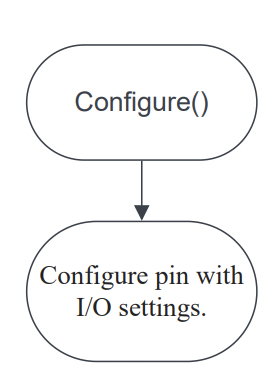|
| Function to lower the brightness of the leds|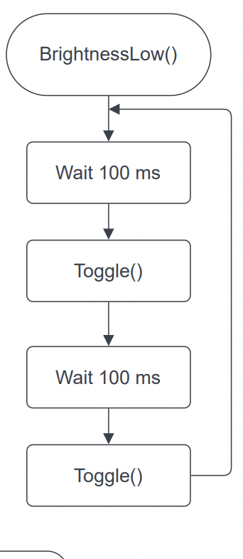 |
| Function to higher the brightness of the leds| 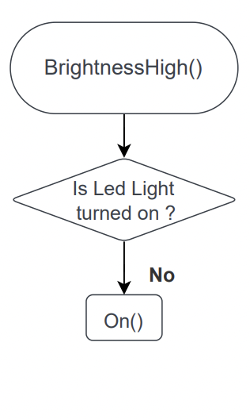|
| Function to blink the led | 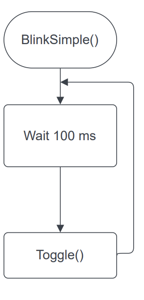|
| Function to set up an ADC pin to convert the analog signal to a tension in volts | 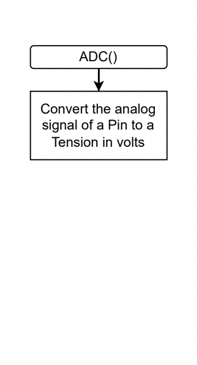|
| Function to know the state of a led | 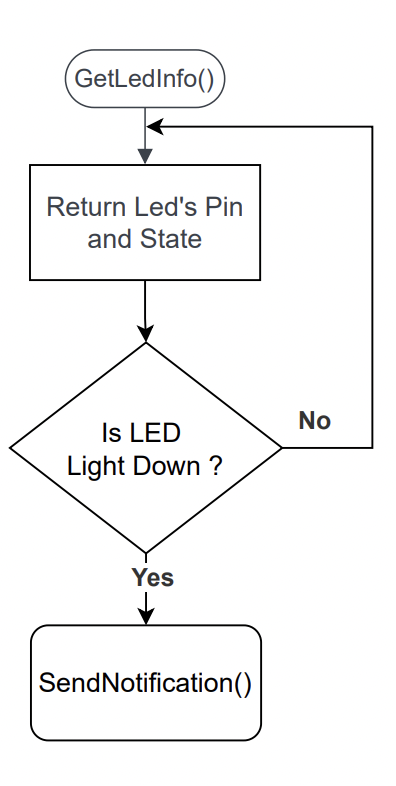|
| Function to know the tension from a tension sensor connected on a ADC pin |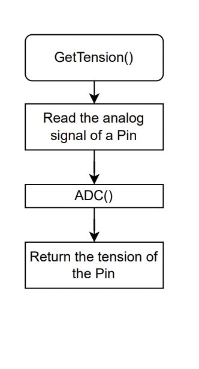 |
| Function to swith on or off any kind off pins|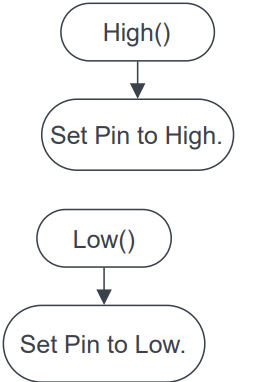|
| Function to set up a new led | 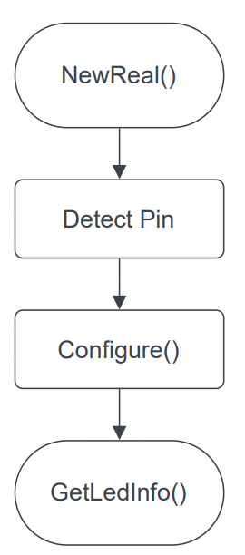|
| Function to swith off th led  |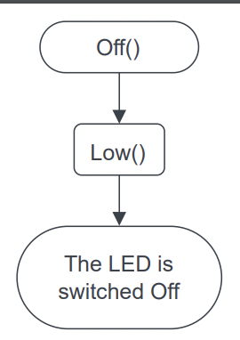  |
| Function to swith on th led | 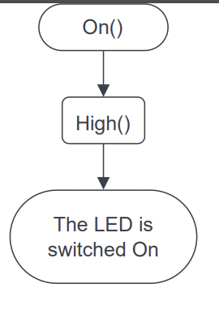 |
| Function to configure an ADC pin where a tension sensor is plug and return results from the sensor |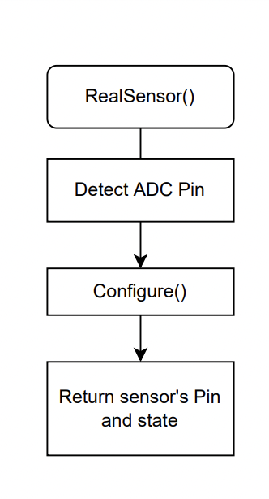  |
| Function to receive notification from the Lora and function to switch off the light in agreement with the Ecowatt's level | 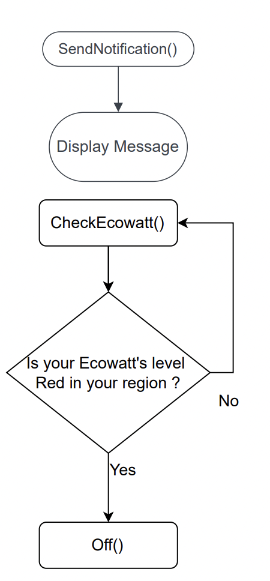 |
| Function to change the state of a led  | 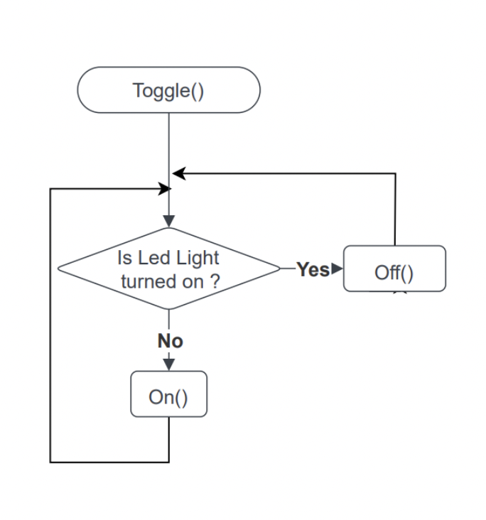 |

## c. Test Plan
Test plan by Victor LEROY :
https://docs.google.com/spreadsheets/d/1H_F60G7YNmifNi9nX2NOWJw-gs1-F-nA7Pi6IcHi6kQ/edit#gid=2124204330

## d. Release / Roll-out and Deployment Plan

**SignAll** wants to release the product as soon as possible. They want to create a new line of product connected based on our product. They said " We want to be the first on this market". This product needs to be available for all the customers of **SignAll** but not only because they also want to sell this product to the competitor's customers. Indeed, if the product can be used on different signs of different brands, the market has no limit. In addition it's a really positive point for their brand image to be the precursor on this type of product.  

## e. Alternate Solutions 

We can see this problem from a different perspective and propose a different approach to solve it. One of the point that we can discuss is why use Lora instead of Wifi.  
With a 4G card and an internet connection dedicated to the device we can think that it is the good solution for this problem but it isn't. One of the reason that we can't use Wifi it's because a large part of the market of SignAll are banks and insurances. Using a wifi network in these type of shops increases the risk of hacks and data leaks. 
# 4. Further Considerations
## a. Impact on other teams

 **SignAl** technicians cannot at the moment, identify if a sign is broken or not without visiting the site. So with our product we can save a lot of time for technicians. 

 ## b. Regional considerations

Signall is implemented all over Europe and the regulation about ad signs are different from one country to another. Let's take France as an example. In France ad signs can't blink except tobacco shops and pharmacies. The product must take this into consideration.

## c. Cost analysis

Let's talk about cost. First of all the company needs to produce the device. Then it sells the product to their customers. For the customer's side, he needs to buy the product and the installation. In addtition during the year he needs to pay the extra electricity generated by the product. 

## d. Security considerations

The main element of safety is the safety of the hardware. The hardware must be safe, waterproof and not dangerous for customers and technicians. We must avoid any problems related to fire and electric shock. For the software part we need to be careful that it is not possible for a hacker to overheat the leds.

## e. Privacy considerations

We use Lora to avoid a lot of problems with data privacy, data leaks. If instead of using Lora, we used  wifi, it would have been much more problematic, because wifi is weaker in terms of security. 

## h. Support considerations

At the moment the support is complicated with the actual sign. There is no way to know if a sign is broken or not. The only way is to move where the sign is located. So one of the goal of the product is to save the technician time by avoiding them to move for nothing. In addition Signall want to predict the future state of led depending of the weather. 
# 5. Work
## a. Prioritization

| Function                        | Flexibility         |
| ---------------------------- | ---------------------------------------------------------------------------------------------------------------------------------------------------------------------------------------------------------------------------------------------------------------------------------------------------------------------------------------------------- |
| Turn on/off the light| F1 |
| Reduce/increase the light intensity| F2 |
| Know the led status |F2|
| Know the brightness of a led  |F1|
| Turn off the light in accord with the law|F0|
| In accord to Ecowatt, turn off or reduce the light|F0 |
| Send a notification when a led is down | F2|
| Programable light which light up on various hours |F0 |
## b. Milestones

- 1st week: 
-The first week we will finish the introduction of the project, writing the documentation 
-Functional Specification 
-Technical Specification 
-Architecture Diagram 

- 2nd week: 
-We look how to use the HW and which one we are going to use 
-Write all the questions that we need to ask to Signall 
-Try to use the HW 

- 3rd week: 
We are going deeper, and start to code 
-Blink the Leds 
-Connect the sensors 
-Quality checking 

- 4rd week: 
-Know the brightness of a led 
-Link lora board and bluepill 
-Turn off the light according to the law 
-Programable light that lights up on various hours 
-Meeting with Signall 
-Quality checking 

- 5th week: 
This is the last step of the project, everything should be done and ready to present to the client ! 
-Oral presentation

# 6. End Matter

## a. References

https://www.oflabs.com/hello-word-avec-tinygo-et-bluepill/
https://tinygo.org/docs/reference/microcontrollers/bluepill/
https://tinygo.org/docs/reference/microcontrollers/machine/bluepill/
https://www.electronicshub.org/getting-started-with-stm32f103c8t6-blue-pill/
https://microcontrollerslab.com/adc-esp32-measuring-voltage-example/
https://wiki.seeedstudio.com/LoRa_E5_Dev_Board/

## b. Acknowledgement

Tanguy Herrmann -- contact:  tanguy@tuxago.com 
Delphine Prousteau -- contact: dprousteau@quanaup.fr 
Jihane Billacois -- contact: jihb@sent.com 
Cedric Dumez -- contact: cedric.dumez@signall.com 